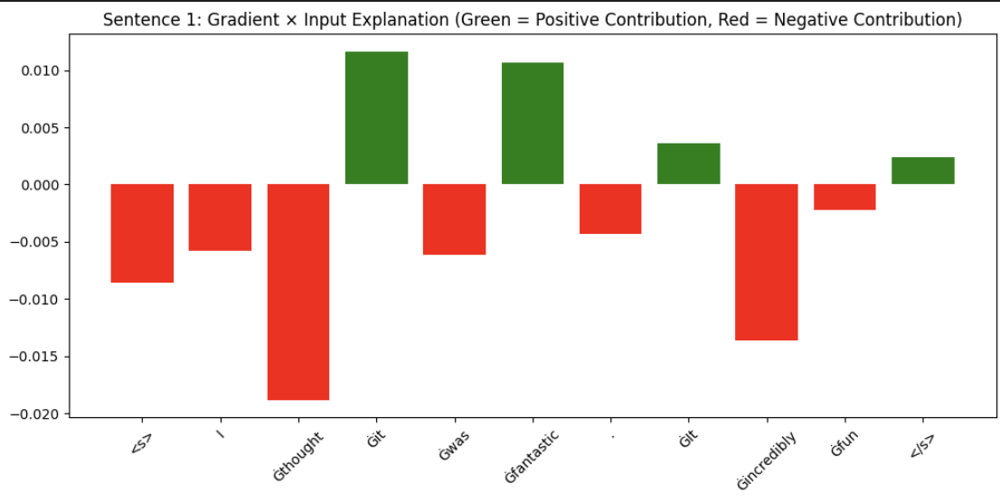
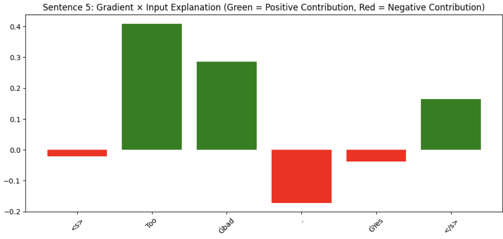
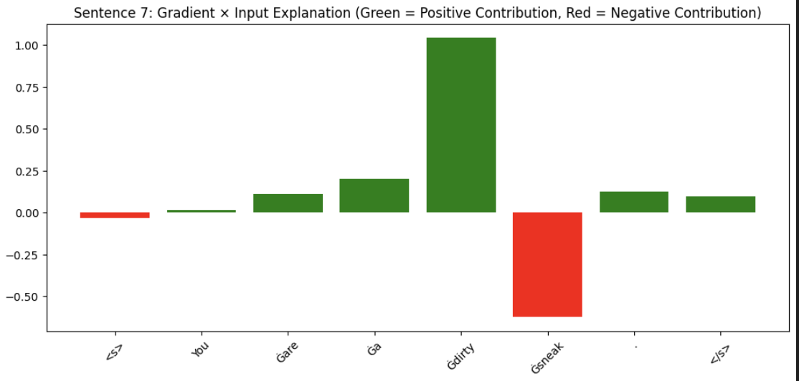
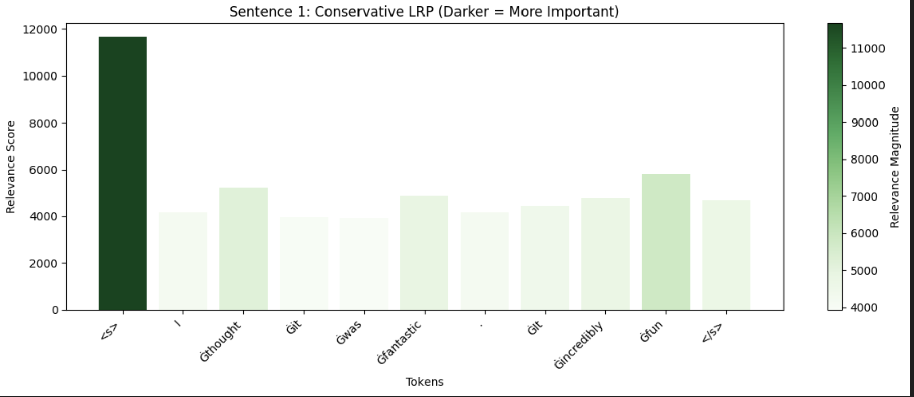
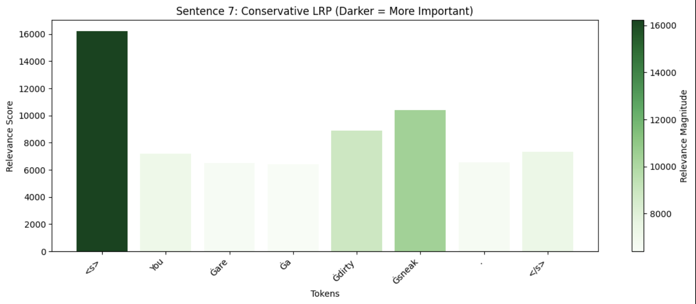
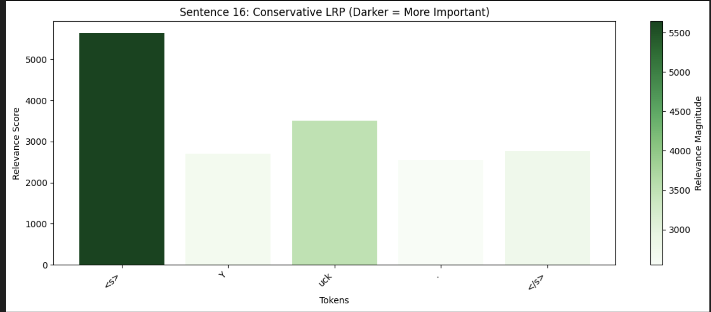
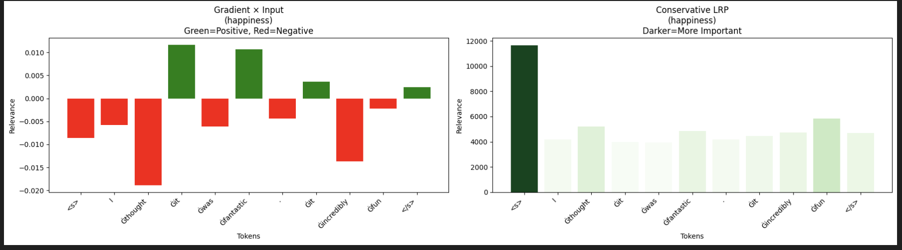
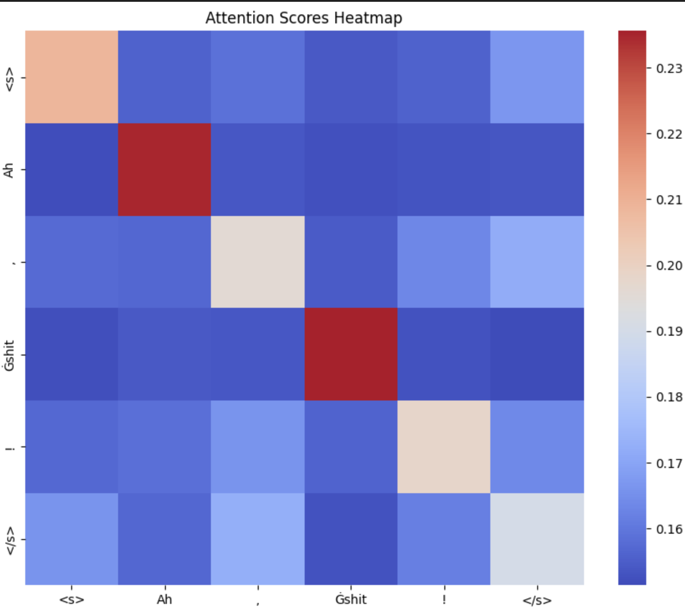
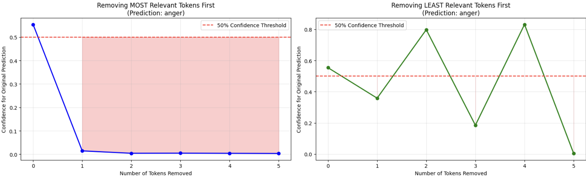

# Explainable AI Analysis for Emotion Classification Model

## Introduction

Transformer models are really powerful for tasks like emotion classification, but they're basically black boxes. You feed text in, get a prediction out, and have no idea what's actually happening inside. For this task, we wanted to understand how our emotion classification model actually makes its decisions. Does it focus on the obvious emotion words like "fantastic" or "terrible", or is it picking up on something else entirely?

We used the method from Ali et al.'s 2022 paper "XAI for Transformers: Better Explanations through Conservative Propagation" to look inside our model. The main goal was to see if the model is actually learning what we think it's learning, or if it's maybe relying on weird patterns or shortcuts that don't make sense. This matters because if the model is making predictions for the wrong reasons, it might fail on new data even if it looks good on the test set.

## Methodology

### Sentence Selection

We picked 3 sentences for each of the 6 emotions our model was trained on: anger, disgust, fear, happiness, sadness, and surprise. That gave us 18 sentences total. We tried to pick a mix, some really obvious ones like "Yuck" for disgust, and some more subtle ones where the emotion comes from context rather than a single word. We also included different sentence lengths to see if that affected how the model processed them.

### Three XAI Techniques Applied

We applied three different techniques to understand the model:

**Gradient × Input** is the basic approach. It multiplies the gradient of the prediction with respect to each token by the input embedding itself. This shows which tokens the model is "sensitive" to, basically which words would change the prediction most if you tweaked them slightly.

**Conservative Propagation (LRP)** is an improved version that's specifically designed for transformers. Regular LRP has problems with attention layers and layer normalization, so this conservative approach redistributes relevance scores more carefully through the network to get more stable explanations.

**Input Perturbation** tests how robust the model is by removing tokens one at a time and watching the confidence drop. If the model's confidence crashes after removing just one word, it's probably relying too heavily on that specific token.

## Part 1: Gradient × Input Analysis

*Figure 1: Gradient × Input visualization for happiness sentence showing token contributions*

*Figure 2: Gradient × Input visualization for sadness sentence*

*Figure 3: Gradient × Input visualization for anger sentence*

Looking at the visualizations, there are some things that make sense and some surprises. For the happiness sentences, "fantastic" and "fun" both show strong positive contributions (green bars), which is exactly what you'd expect. The model is clearly picking up on these obviously positive words. Same with "Congratulations" in the second happiness sentence, huge green bar.

What's interesting though is that the special tokens like `<s>` (start token) and `</s>` (end token) also show relatively high relevance scores, even though they shouldn't contain any emotional information. We're using a RoBERTa model, so these tokens are just structural markers. It's a bit weird that they're contributing to the emotion prediction at all.

For the sadness sentences, "bad" shows a strong positive contribution toward the sadness prediction, which makes sense, the model learned that "bad" is associated with negative emotions. But looking at "Gone as her prime suspect", it's less clear which specific words are driving the sadness prediction. The relevance is more spread out across multiple tokens.

The anger sentences are interesting because words like "dirty" and "sneak" both contribute positively, but so do some of the function words in between. We think this might be because anger often involves multi-word insults, so the model is picking up on the phrase as a whole rather than individual words.

One thing that stood out across multiple sentences: punctuation marks sometimes have unexpectedly high relevance. Exclamation marks in particular seem to boost certain predictions. This actually makes sense - punctuation does carry emotional information in text. A sentence ending with "!" feels different from one ending with a period.

## Part 2: Conservative Propagation Analysis

*Figure 4: Conservative LRP visualization for happiness sentence. Darker green means more important.*

*Figure 5: Conservative LRP visualization for anger sentence. Notice how importance is spread across multiple tokens.*

*Figure 6: Conservative LRP visualization for disgust sentence showing concentrated importance on emotion words.*

For the Conservative Propagation analysis, we switched to gradient coloring (light to dark green) instead of the red/green bars from Part 1. Darker green means a token is more important. This is different from Gradient × Input because LRP scores are always positive. They measure how much each token contributes, not whether it pushes the prediction up or down. The main improvement of Conservative LRP for transformers is how it handles attention weights and layer normalization. It redistributes relevance more carefully through the network so you get more stable explanations.

Looking at the happiness sentence (Figure 4), "fantastic" and "fun" both show up as dark green, so they're clearly the most important tokens. But what's interesting is the importance spreads out more compared to the Gradient × Input method. Tokens like "incredibly" and "was" show moderate importance (medium green), which suggests the model isn't just looking at individual emotion words but considering how they work together with context.

For the anger sentence (Figure 5), the relevance spreads across multiple tokens including "dirty" and "sneak", but also some of the words around them. This makes sense because anger expressions usually involve multi-word phrases rather than single words. The Conservative LRP method seems to capture this better than the basic gradient approach because it accounts for how information flows through the attention mechanism.

The disgust sentence (Figure 6) shows a more concentrated pattern. "Ah" and "shit" both show up as dark green and basically dominate the prediction. Makes sense because disgust is usually triggered by specific words or concepts rather than overall context. The punctuation mark also shows some importance, which lines up with what we saw in the Gradient × Input analysis.

Compared to the basic Gradient × Input method, Conservative LRP spreads the relevance out more evenly. With the basic method, we sometimes saw one or two tokens with huge spikes, but the LRP approach shows more of how different tokens work together.

Something really interesting we noticed: the `<s>` (start) token consistently shows up as one of the highest scoring tokens across basically all sentences in the Conservative LRP analysis. This is kind of weird at first because it's just a structural marker that shouldn't carry emotional meaning. But there's actually a reasonable explanation. In RoBERTa and similar transformers, the classifier sits on top of the `<s>` token's final representation. So all the information from the entire sentence gets pooled into that position through the attention mechanism before making the final prediction. The Conservative LRP method traces relevance backwards through this process, which means a lot of relevance naturally accumulates at `<s>` since it's the direct input to the classification layer. It's not that `<s>` itself is important, it's that it acts as an aggregation point for information from all the other tokens. The `</s>` (end) token shows some relevance too but usually less than `<s>`, which makes sense given how the model architecture works.

One pattern that showed up for all emotions: Conservative LRP shows the model isn't just doing keyword matching. Even for super obvious cases like "Yuck" for disgust, the surrounding tokens get non-zero importance scores. This suggests the model architecture forces it to consider context through attention, even when a single word would be enough for a human to recognize the emotion.

The gradient coloring is way easier to read at a glance compared to binary red/green. You can immediately see which tokens dominate (dark green), which contribute a bit (medium green), and which barely matter (light green). Makes it clearer how relevance scores work in LRP since they're continuous values.

### Comparing Methods: Gradient × Input vs Conservative LRP

*Figure 7: Side by side comparison of Gradient × Input (left) and Conservative LRP (right) for the same sentence. Notice the different color schemes and how relevance gets distributed.*

When you put them side by side, the differences are pretty clear. Gradient × Input shows both positive (green) and negative (red) contributions, while Conservative LRP only shows varying shades of green. For this sentence, Gradient × Input has stronger peaks on specific tokens, while Conservative LRP spreads the relevance more evenly across related tokens. Neither method is necessarily better, they just show different things. Gradient × Input is good for seeing which tokens push the prediction in a certain direction. Conservative LRP is better for seeing the overall importance ranking while accounting for how transformers actually process sequences through attention.

### Attention Mechanism Visualization

*Figure 8: Attention scores heatmap showing how tokens attend to each other in the first attention layer. Darker colors mean stronger attention.*

The attention heatmap gives another way to look at what's happening inside the model. The strong diagonal line shows tokens mostly pay attention to themselves, which is normal for transformers. But there are also some interesting patterns off the diagonal. The special tokens `<s>` and `</s>` have pretty uniform attention across all other tokens, which suggests they might be acting as some kind of aggregation points where information gets pooled before the final classification. Some of the content tokens show stronger attention connections to specific other tokens, which is how the model builds up an understanding of context by relating words to each other. This visualization is useful alongside the relevance scores because it shows the pathways information flows through in the model.

## Part 3: Token Perturbation and Model Robustness

*Figure 9: Comparison of token removal strategies - removing most relevant tokens (left) versus least relevant tokens (right)*

The perturbation analysis shows how the model's confidence changes when we remove tokens one by one. While the task suggested removing only the least relevant tokens, we found it much more insightful to show both strategies side-by-side. This comparison clearly demonstrates which tokens actually matter for the model's predictions. We tested two different removal strategies: removing the most relevant tokens first (based on relevance scores) versus removing the least relevant tokens first.

The side-by-side comparison reveals a striking difference. On the left graph, when we remove the most relevant tokens, the model's confidence crashes dramatically. Starting from about 55% confidence for the anger prediction on "Ah, shit!", the confidence plummets to around 2-3% after removing just the first token, then hovers near zero for the rest. This sharp drop tells us the model is heavily reliant on one or two specific tokens.

On the right graph, when we remove the least relevant tokens first, the behavior is more erratic. The confidence fluctuates significantly, sometimes even increasing after token removal. This zigzag pattern reveals something important: replacing tokens with PAD tokens doesn't just "remove" information, it actually changes the input in ways that can confuse the model. The PAD tokens create an unusual input pattern that the model hasn't been trained on, leading to unpredictable behavior. Despite the fluctuations, the overall pattern shows that removing less important tokens doesn't cause the immediate confidence collapse we see on the left.

The 0.5 threshold line (shown in red) marks where the model becomes uncertain, basically just guessing. For this sentence, removing just one important token causes the confidence to plummet below 50%, which suggests the prediction is quite fragile and depends critically on specific words rather than a broader understanding of the sentence.

This behavior varies depending on sentence structure. For very short sentences with clear emotion words, we see this kind of sharp drop because there are so few tokens contributing to the prediction. The model doesn't have much redundancy to fall back on. For longer, more complex sentences with multiple emotion indicators, we'd expect to see a more gradual decline as the model can rely on multiple cues.

The comparison validates that our gradient-based relevance scores are actually meaningful. The tokens identified as "most relevant" truly are the ones the model depends on for its prediction. This isn't just a quirk of the gradient calculation, it reflects real dependencies in how the model makes decisions.

## Discussion and Key Findings

Looking at everything together, the XAI analysis shows our model does focus on emotionally charged words, which is good. It picks up on obvious emotion words like "fantastic", "bad", and "shit", and assigns them high relevance scores. But it's not just doing simple keyword matching. The attention heatmaps show the model is actually considering how words relate to each other.

The biggest concern is how fragile the predictions are. The perturbation test showed that for short sentences, removing just one or two key tokens causes the confidence to crash from 50-60% down to almost nothing. The model is basically relying on specific keywords rather than understanding the broader emotional meaning. If you were actually deploying this, it would probably struggle with typos or if people use different words to express the same emotion.

Something odd we noticed: the special tokens (`<s>` and `</s>`) show up as having high relevance in the Gradient × Input analysis, even though they're just structural markers and shouldn't carry any emotional information. This seems like it might be a quirk of how gradients work in transformers. The gradients can be high for tokens that aren't actually important for the prediction. That's why the perturbation test was useful to double-check which tokens really matter.

Different emotions behave differently too. Disgust and anger predictions tend to depend heavily on one or two strong words, while sadness is more spread out across the whole sentence. This kind of makes sense from a human perspective. You usually feel disgusted by specific things or words, but sadness often comes from the overall mood of what someone's saying.

The attention mechanism turned out to be more important than we expected. Just looking at which individual tokens are important doesn't give you the full picture. You need to see how the tokens interact with each other through attention to really understand what the model is doing.

## Conclusion

This XAI analysis was pretty eye-opening. Before this, we only knew our model got decent test accuracy. Now we actually understand what it's doing and where it falls short. The good news is the model does learn reasonable patterns and uses attention to understand context. The bad news is it's way more fragile than we thought.

If we had to improve the model based on these findings, we'd focus on robustness. Maybe use data augmentation with synonym replacement or train on more varied ways of expressing emotions. That way it wouldn't completely fall apart when it sees a typo or a paraphrased version of something.

We also learned you can't just trust gradient-based explanations at face value. The perturbation tests were really important for validating what actually matters versus what just looks important from the gradients. This kind of analysis should probably be standard practice before deploying any model in production. Test accuracy only tells you so much.

## References

Ali, A., Schnake, T., Eberle, O., Montavon, G., Müller, K. R., & Wolf, L. (2022). XAI for Transformers: Better Explanations through Conservative Propagation. In *Proceedings of the 39th International Conference on Machine Learning* (Vol. 162, pp. 435-451). PMLR.

---
