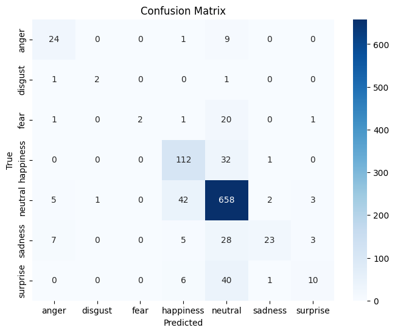

## Error Analysis for fine-tuned roberta-base-go_emotions

This report details a error analysis of our fine-tuned roberta-base-go_emotions, evaluating its performance, identifying core weaknesses, and linking these findings directly to the project's objectives for the **Content Intelligence Agency (CIA)**. The CIA’s core mission is to use AI to analyze media content—such as films and TV shows—in detail, and the model's ability to accurately classify the emotional tone of text is a key component of this pipeline.

---

### Model Strengths and Principal Weaknesses

The model's performance exhibits a clear pattern: it is reliable for majority classes but critically unreliable for minority and nuanced emotion categories.

#### Strengths: Reliability on Dominant Classes

The overall model **Accuracy is 0.7975**, this value is largely driven by strong performance on the most frequent emotional states, which provides a baseline for general content analysis.

* **Neutral:** The model performs very well on **Neutral** sentences, achieving an **F1-score of 0.8779** due to its large **support (711 samples)**, **Recall of 0.9255** and **Precision of 0.835** (Table 1). Tells us that most non-emotional or objective text segments in media content are correctly classified.

* **Happiness:** Performance is also strong for **Happiness (F1-score = 0.7179)**, benefiting from its relatively high frequency (**145 samples**) and a generally clearer semantic boundary.

| Label      | Precision | Recall | F1-score | Support |
|------------|-----------|--------|----------|---------|
| anger      | 0.6316    | 0.7059 | 0.6667   | 34      |
| disgust    | 0.6667    | 0.5000 | 0.5714   | 4       |
| fear       | 1.0000    | 0.0800 | 0.1481   | 25      |
| happiness  | 0.6707    | 0.7724 | 0.7179   | 145     |
| neutral    | 0.8350    | 0.9255 | 0.8779   | 711     |
| sadness    | 0.8519    | 0.3485 | 0.4946   | 66      |
| surprise   | 0.5882    | 0.1754 | 0.2703   | 57      |
| **accuracy**   |           |        | **0.7975** | 1042    |
| **macro avg**  | 0.7491    | 0.5011 | 0.5353   | 1042    |
| **weighted avg** | 0.7964    | 0.7975 | 0.7726   | 1042    |
*Table 1: This table shows the classification report on the test set*

### Weaknesses: Failure on Minority and Subtle Emotions

Despite the high overall accuracy, the low **macro-averaged F1-score of 0.535** reveals poor performance across multiple classes, a major weakness for a client needing emotional detail.

* **Impact of Class Imbalance:** The large number of **Neutral** sentences biases predictions. Minority classes are largely neglected:
    * **Fear** shows a near-total detection failure with **Recall of only 0.0800** (Table A1). The model rarely predicts this class, which is detrimental for analyzing high-tension or dramatic content. **23 errors** were attributed to the True Label of Fear (Table A2).
    * **Disgust** is statistically unreliable due to its minimal support (**4 samples**).
* **Confusion in Subtle Emotions:** The model struggles with emotions that overlap semantically:
    * **Surprise** performs poorly (**F1-score = 0.2703**), likely confused with Neutral or Happiness. This is a significant error source, accounting for **47 errors** for the *True Label* of Surprise (Table A2).
    * **Sadness** has a low **Recall of 0.3485** (**43 errors**), indicating that it is often missed or misclassified as another emotion, hindering accurate analysis of a scene’s dramatic arc.

The misclassification analysis (Table A3 and Confusion Matrix 1) clearly shows the model's tendency to **overpredict Neutral (130 false predictions)** and **Happiness (55 errors)**.  This means that negative or subtle emotional moments are being misclassified which, which would limit the CIA's ability to perform effective emotional classification using this model on subtle or negative emotions.

---
| True Label | Errors |
|------------|--------|
| neutral    | 53     |
| surprise   | 47     |
| sadness    | 43     |
| happiness  | 33     |
| fear       | 23     |
| anger      | 10     |
| disgust    | 2      |
*Table 2: This table shows the errors per True Label
### Table A3 — Errors per Predicted Label
| Predicted Label | Errors |
|-----------------|--------|
| neutral         | 130    |
| happiness       | 55     |
| anger           | 14     |
| surprise        | 7      |
| sadness         | 4      |
| disgust         | 1      |

### Confusion Matrix 1 Confusion Matrix fine-tuned pretrained roberta-base-go_emotions model

**
---

---

### Linguistic, Data, and Algorithmic Error Patterns

Specific data issues and model training behavior introduce systematic errors that compound the class imbalance problem.

* **Data Quality: Ambiguity and Mistranslation:**
    * The non-standard reduction from **28 fine-grained GoEmotions labels to 7 broad classes** creates artificially ambiguous boundaries, forcing subtle emotions into coarse, overlapping categories (e.g., differentiating between different kinds of "positive" emotions now mapped to "Happiness").
    * **Systematic mistranslations** (e.g., "one" for the Dutch word "een") introduce **linguistic noise and ambiguity**, altering sentence meaning and leading to misclassifications.
* **Missing Context and Short Texts:** Errors frequently correlate with **short sentences** and the use of **non-specific/general language**. The model defaults to its majority-class bias (Neutral or Happiness) when meaningful context is truncated or missing, as suggested by the generic language observed in the Wordcloud of misclassified examples. The model fails to extract emotion from sparse text inputs.
* **Overfitting:** The fine-tuning results (Fine-Tuning results 1) show classic signs of **overfitting**: Training Loss steadily decreases (0.614 $\rightarrow$ 0.371) while Validation Loss **increases** after Epoch 1 (0.744 $\rightarrow$ 0.94). This indicates the model is memorizing the training data but losing the ability to generalize to new, unseen text. The model needs stronger regularization and a lower learning rate to help the models ability to generalizability on the client's diverse content.

### Fine-Tuning results 1
| Epoch | Training Loss | Validation Loss | Accuracy |    F1    | Precision | Recall |
|:-----:|:-------------:|:---------------:|:--------:|:-------:|:---------:|:------:|
|   1   |    0.613600   |     0.743808    | 0.797505 | 0.772562 | 0.796392  | 0.797505 |
|   2   |    0.459200   |     0.896016    | 0.753359 | 0.748641 | 0.771063  | 0.753359 |
|   3   |    0.371500   |     0.939642    | 0.764875 | 0.756729 | 0.773386  | 0.764875 |

---

### Conclusion and Prioritized Interventions

The current model provides a foundation for analyzing majority emotional states but is not able to be used for providing the insights into subtle and minority emotions required by the Content Intelligence Agency. The weaknesses are caused by class imbalance, data quality issues, and model overfitting. Addressing these issues will contribute to delivering a high-quality and reliable emotion classification model.

The highest-impact, low-effort interventions are prioritized to maximize return for the client:

1.  **Priority 1: Class Rebalancing & Label Quality (High Gain, Low Effort):** Implement **class-weighted loss** or **oversampling** for minority classes (Fear, Sadness, Surprise) to mitigate the bias toward Neutral. In addition to checking and correct label issues and translation errors (like "one"/"een") to clean the data.
2.  **Priority 2: Model Calibration and Augmentation (Medium Effort):** Employ **threshold tuning** per class to specifically boost the recall of underrepresented classes (e.g., Fear, Surprise). Additionally, apply **data augmentation** (e.g., back-translation) to create more training examples for these crucial, sparse emotional categories.

By focusing on class balance and data integrity first, we can transform the model from one that achieves high overall accuracy by correctly classifying Neutral, into one that provides reliable emotional classification across all classes, which would meet the requirements of the Content Intelligence Agency.

# Appendix

### Wordcloud misclassified
  
*Figure 1: Wordcloud of misclassified examples. This image shows the most common words for all misclassified classes*
### Wordcloud correctly classified
*Figure *Figure 1: Wordcloud of test set. This image shows the most common words for all classes in the test set*

